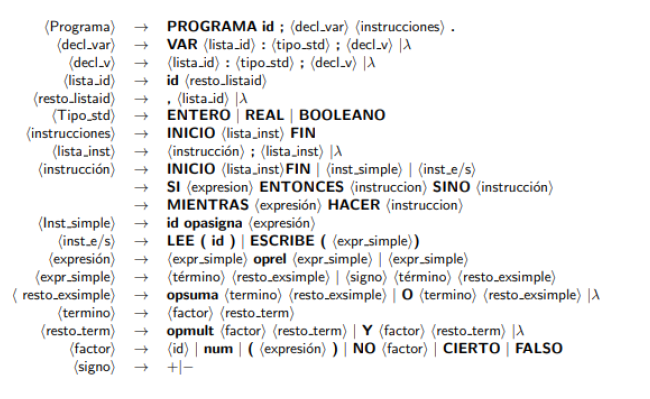

# Analizador de ficheros
Este proyecto permite 

## Estructura del lenguaje
Detalles acerca de la lexicas, como las palabras reservadas se encuentran en la memoria `docs\memoria.pdf`

En cuanto a las reglas sintácticas, un subconjunto limitado de las mismas se muestran en la imagen inferior

Por último las reglas semánticas del lenguaje se ven definidas en el pdf.

Como resultado final, se obtiene un arbol de la descomposición de instrucciones del código, que pueden ser convertidos a otros lenguajes de programación.
Un ejemplo de este árbol para un fichero sin errores es el siguiente

## Compilador de un lenguaje de programación
Dentro del código se pueden encontrar ficheros .py que nos permiten realizar las sigueintes acciones:
<ul>
<li>`anasem.py`: realiza el análisis semántico y nos devuelte un árbol con las instrucciones del programa pasado por parámetro </li>
<li>`anasint.py`: comprueba que el programa pasado sigue unas reglas de sintaxis definidas en una gramática </li>
<li>`anasem.py`: obtiene las categorías léxicas de un programa pasado por parámetro</li>

</ul>  
El procedimiento seguido y demás detalles acerca del lenguaje se pueden encontrar en `docs\memoria.pdf`

## Como probar la corrección de un fichero
Desde la propia linea de comandos, se ha de llamar al fichero de forma directa, usando como primer parámetro la direccion del fichero a compilar y obtener el árbol.
